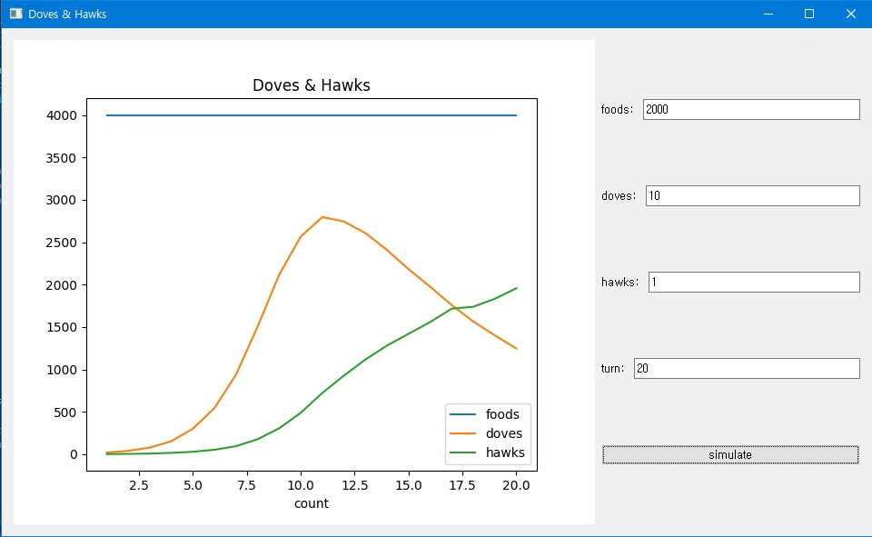

# Doves & Hawks

### First, Watch this video! 🎬

[](https://www.youtube.com/watch?v=YNMkADpvO4w)

```
In this Video, there are two strategy.
Share strategy = Doves, Take strategy = Hawks.
In this Repo, show the results of the simulation according to the values(foods count, Doves count, Hawks count) you set using PyQt5.
```

